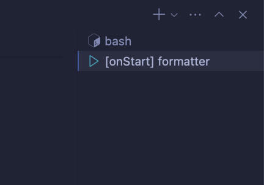

#### 小筆記

https://supabase.com/docs/guides/self-hosting/docker

---

Get started by customizing your environment (defined in the .idx/dev.nix file) with the tools and IDE extensions you'll need for your project!

## Learn more at https://firebase.google.com/docs/studio/customize-workspace

# EAS

## 啟動說明

[WARNING]

```bash


#! 專案根目錄
ENV=dev && docker compose up --build -d


```

## 開發說明

### Step 1


